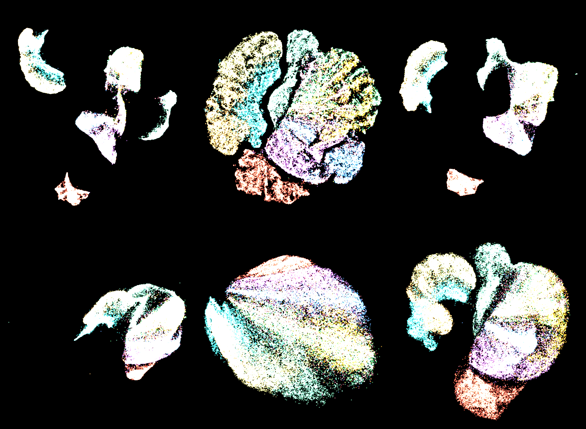

# mlx-vis

Pure MLX + NumPy implementations of UMAP, t-SNE, PaCMAP, and NNDescent for Apple Silicon. No scipy, no sklearn - just Metal GPU acceleration via MLX.



## Install

```bash
uv pip install mlx-vis
```

From source:

```bash
git clone --recurse-submodules https://github.com/hanxiao/mlx-vis.git
cd mlx-vis
uv pip install .
```

## Usage

```python
import numpy as np
from mlx_vis import UMAP, TSNE, PaCMAP, NNDescent

X = np.random.randn(10000, 128).astype(np.float32)

# UMAP
Y = UMAP(n_components=2, n_neighbors=15).fit_transform(X)

# t-SNE
Y = TSNE(n_components=2, perplexity=30).fit_transform(X)

# PaCMAP
Y = PaCMAP(n_components=2, n_neighbors=10).fit_transform(X)

# NNDescent (approximate k-NN graph)
indices, distances = NNDescent(k=15).build(X)
```

Submodule imports also work:

```python
from mlx_vis.umap import UMAP
from mlx_vis.tsne import TSNE
from mlx_vis.pacmap import PaCMAP
from mlx_vis.nndescent import NNDescent
```

## Methods

| Method | Class | Main API | Output |
|--------|-------|----------|--------|
| UMAP | `UMAP(n_components, n_neighbors, min_dist, ...)` | `fit_transform(X)` | `np.ndarray (n, d)` |
| t-SNE | `TSNE(n_components, perplexity, ...)` | `fit_transform(X)` | `np.ndarray (n, d)` |
| PaCMAP | `PaCMAP(n_components, n_neighbors, ...)` | `fit_transform(X)` | `np.ndarray (n, d)` |
| NNDescent | `NNDescent(k, n_iters, ...)` | `build(X)` | `(indices, distances)` |

## Visualization

Requires `matplotlib` and `ffmpeg` (for video). Not installed by default.

```python
from mlx_vis import UMAP, scatter, animate
import numpy as np

X = np.random.randn(10000, 128).astype(np.float32)
Y = UMAP(n_components=2).fit_transform(X)

# static scatter plot
scatter(Y, title="My Embedding", save="plot.png")

# with labels
labels = np.random.randint(0, 5, 10000)
scatter(Y, labels=labels, theme="dark", save="labeled.png")
```

Animation from epoch snapshots:

```python
snaps, times = [], []
import time; t0 = time.time()

def cb(epoch, Y_np):
    snaps.append(Y_np)
    times.append(time.time() - t0)

Y = UMAP(n_components=2, n_epochs=200).fit_transform(X, epoch_callback=cb)

animate(snaps, labels=labels, timestamps=times,
        method_name="umap-mlx", save="animation.mp4")
```

Full Fashion-MNIST example with all three methods:

```bash
python -m mlx_vis.examples.fashion_mnist --method umap --theme dark
python -m mlx_vis.examples.fashion_mnist --method all
```

## Dependencies

- `mlx >= 0.20.0`
- `numpy >= 1.24.0`

## License

Apache-2.0
